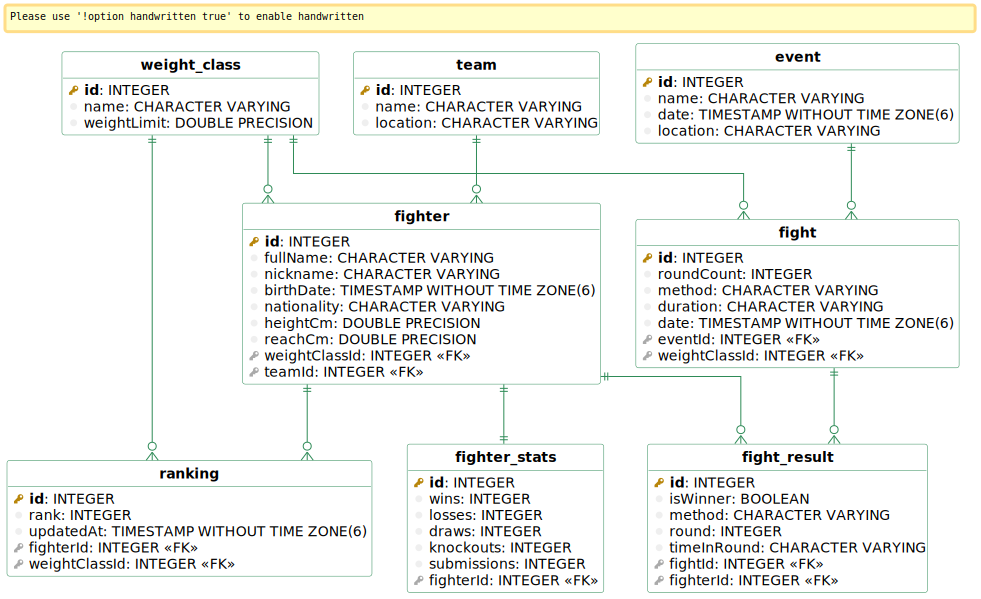

# UFC Backend API

A NestJS-based backend API for managing UFC fighters, events, and rankings.

## Database Schema


## Features

- Fighter management (CRUD operations)
- Event scheduling and management
- Fight results tracking
- Automatic ranking updates
- Fighter statistics
- Weight class management
- Team management

## Prerequisites

- Node.js (v16 or higher)
- Docker
- npm or yarn
- PostgreSQL (via Docker)

## Getting Started

1. Start the PostgreSQL database using Docker:
```bash
docker-compose up -d
```
2. Install dependencies:
```bash
npm install
 ```

3. Run database migrations and seed initial data:
```bash
npm run seed
 ```

4. Start the development server:
```bash
npm run start:dev
 ```

The API will be available at http://localhost:3000/graphql

## Project Structure
```plaintext
src/
├── entities/         # Database entities
├── fighters/         # Fighter-related modules
├── events/          # Event management
├── rankings/        # Ranking system
├── database/        # Database configurations and seeds
└── shared/          # Shared utilities and types
 ```
